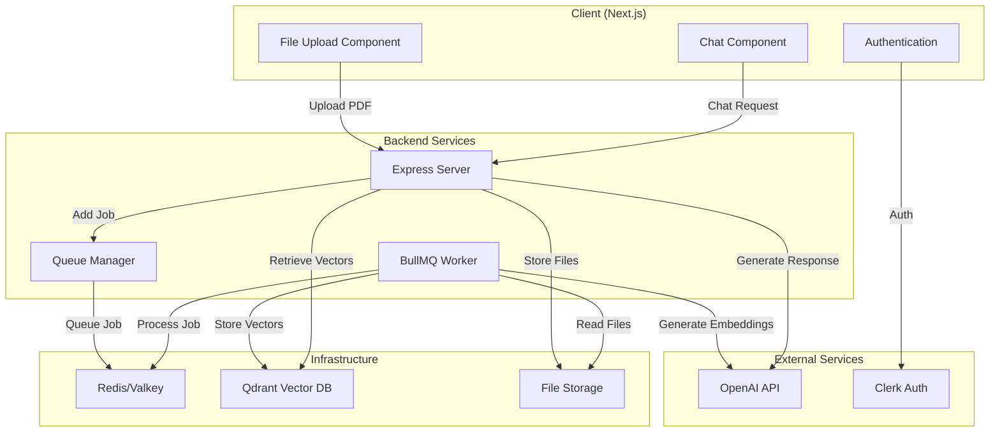
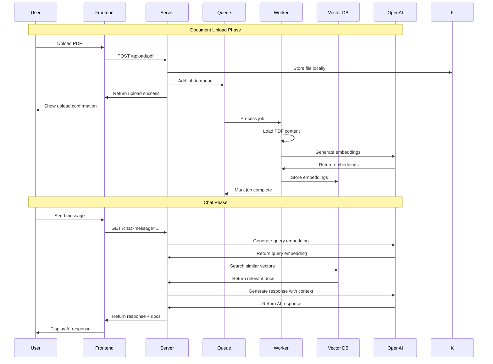
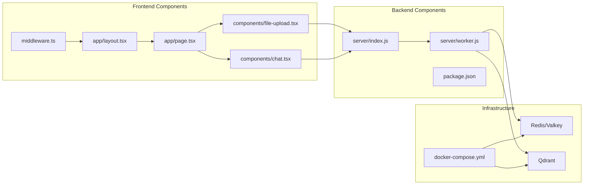
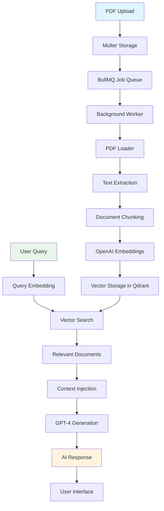

# PDF RAG Architecture Diagrams

## System Architecture Overview



## RAG Pipeline Flow



## Component Architecture



## Data Flow Architecture



## Technology Stack Diagram

```mermaid
graph TB
    subgraph "Frontend Stack"
        F1[Next.js 15]
        F2[React 19]
        F3[TypeScript]
        F4[Tailwind CSS]
        F5[Clerk Auth]
    end
    
    subgraph "Backend Stack"
        B1[Node.js]
        B2[Express.js]
        B3[BullMQ]
        B4[LangChain]
    end
    
    subgraph "AI & ML"
        AI1[OpenAI GPT-4.1]
        AI2[text-embedding-3-small]
    end
    
    subgraph "Databases"
        DB1[Qdrant Vector DB]
        DB2[Redis/Valkey]
    end
    
    subgraph "Infrastructure"
        I1[Docker Compose]
        I2[Local File Storage]
    end
    
    F1 --> F2
    F2 --> F3
    F3 --> F4
    F4 --> F5
    
    B1 --> B2
    B2 --> B3
    B3 --> B4
    
    B4 --> AI1
    B4 --> AI2
    B3 --> DB2
    B4 --> DB1
    
    I1 --> DB1
    I1 --> DB2