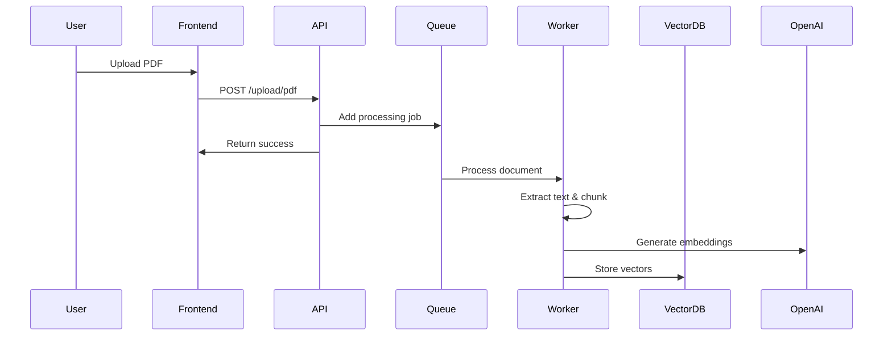
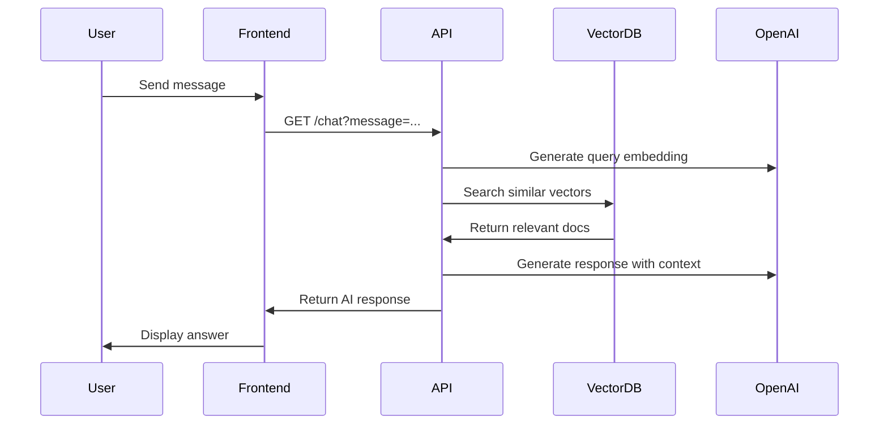

# PDF RAG Application 📚🤖

A comprehensive **Retrieval-Augmented Generation (RAG)** application that allows users to upload PDF documents and chat with their content using AI. Built with modern technologies and event-driven architecture for scalability and performance.

## 🏗️ Architecture Overview

This application follows a **microservices-inspired architecture** with clear separation of concerns:

- **Frontend**: Next.js 15 with React 19 and TypeScript
- **Backend**: Node.js Express server with BullMQ for job processing
- **AI Services**: Gemini Flash & Embeddings (configurable: Gemini, GitHub Models, or OpenAI)
- **Vector Database**: Qdrant for similarity search
- **Queue System**: Redis/Valkey with BullMQ for async processing
- **Authentication**: Clerk for user management

## 🚀 Quick Start

### Prerequisites

- Node.js 18+
- Docker and Docker Compose
- AI Provider API key (Gemini recommended, GitHub Models, or OpenAI)
- Clerk account for authentication

### 1. Clone the Repository

```bash
git clone https://github.com/khush2808/pdf-rag-code.git
cd pdf-rag-code
```

### 2. Start Infrastructure Services

```bash
# Start Redis and Qdrant using Docker Compose
docker-compose up -d
```

### 3. Setup Environment Variables

Create `.env` files in both `server/` and `client/` directories:

**server/.env:**
```env
# AI Provider Configuration (choose one)
AI_PROVIDER=gemini

# Gemini Configuration (recommended)
GEMINI_API_KEY=your_gemini_api_key_here
GEMINI_BASE_URL=https://generativelanguage.googleapis.com/v1beta/openai/
GEMINI_CHAT_MODEL=gemini-2.0-flash-exp
GEMINI_EMBEDDING_MODEL=text-embedding-004

# Uncomment for GitHub Models
# AI_PROVIDER=github
# GITHUB_TOKEN=your_github_token_here
# GITHUB_BASE_URL=https://models.github.ai/inference
# GITHUB_CHAT_MODEL=openai/gpt-4o-mini

# Database Configuration
REDIS_HOST=localhost
REDIS_PORT=6379
QDRANT_URL=http://localhost:6333
NODE_ENV=development
```

> 📋 **See [AI_MODELS_SETUP.md](./AI_MODELS_SETUP.md) for detailed setup instructions for each provider**

**client/.env.local:**
```env
NEXT_PUBLIC_CLERK_PUBLISHABLE_KEY=your_clerk_publishable_key
CLERK_SECRET_KEY=your_clerk_secret_key
```

### 4. Install Dependencies and Start Services

**Backend:**
```bash
cd server
npm install
npm run dev          # Start API server on port 8000
npm run dev:worker   # Start background worker (in separate terminal)
```

**Frontend:**
```bash
cd client
npm install
npm run dev          # Start Next.js app on port 3000
```

### 5. Access the Application

- **Frontend**: http://localhost:3000
- **Backend API**: http://localhost:8000
- **Qdrant Dashboard**: http://localhost:6333/dashboard

## 📋 How It Works

### 1. Document Upload & Processing



### 2. Chat & Retrieval



## 🛠️ Technology Stack

### Frontend
- **Next.js 15**: React framework with App Router
- **React 19**: Latest React with concurrent features
- **TypeScript**: Type safety and better developer experience
- **Tailwind CSS**: Utility-first CSS framework
- **Clerk**: Authentication and user management

### Backend
- **Node.js**: JavaScript runtime
- **Express.js**: Web application framework
- **BullMQ**: Redis-based job queue for background processing
- **LangChain**: Framework for building AI applications
- **Multer**: File upload handling

### AI & ML
- **OpenAI GPT-4.1**: Large language model for chat completions
- **text-embedding-3-small**: Embedding model for vector representations
- **Qdrant**: Vector database for similarity search

### Infrastructure
- **Redis/Valkey**: In-memory data store for queues
- **Docker Compose**: Container orchestration
- **Local File Storage**: PDF file storage

## 📁 Project Structure

```
pdf-rag-code/
├── client/                    # Next.js frontend
│   ├── app/
│   │   ├── layout.tsx        # Root layout with auth
│   │   ├── page.tsx          # Main page
│   │   └── components/
│   │       ├── file-upload.tsx
│   │       └── chat.tsx
│   ├── components/ui/        # Reusable UI components
│   └── middleware.ts         # Auth middleware
├── server/                   # Node.js backend
│   ├── index.js             # Express API server
│   ├── worker.js            # Background job processor
│   └── uploads/             # Uploaded PDF storage
├── docker-compose.yml       # Infrastructure services
└── docs/                    # Documentation
    ├── CODEBASE_DOCUMENTATION.md
    └── ARCHITECTURE_DIAGRAMS.md
```

## 🔄 Event-Driven Architecture

The application uses **BullMQ** for asynchronous job processing:

### Why BullMQ?

✅ **Performance**: Redis-based, extremely fast  
✅ **Reliability**: Job persistence, automatic retries  
✅ **Scalability**: Horizontal scaling with multiple workers  
✅ **Monitoring**: Built-in UI dashboard, job status tracking  
✅ **Type Safety**: Full TypeScript support  

### Job Processing Flow

1. **File Upload**: User uploads PDF → Immediate response
2. **Job Queuing**: File details added to Redis queue
3. **Background Processing**: Worker processes PDF asynchronously
4. **Vector Storage**: Embeddings stored in Qdrant
5. **Ready for Chat**: Document searchable via chat interface

## 🎯 RAG Implementation

### Retrieval-Augmented Generation Pipeline

#### 1. **Indexing Phase** (Document Upload)
```javascript
PDF → Text Extraction → Chunking → Embeddings → Vector Storage
```

#### 2. **Retrieval Phase** (User Query)
```javascript
Query → Query Embedding → Vector Search → Relevant Documents
```

#### 3. **Generation Phase** (AI Response)
```javascript
Retrieved Context + User Query → GPT-4 → Contextual Response
```

### Vector Search with Qdrant

- **Embedding Model**: OpenAI text-embedding-3-small (1536 dimensions)
- **Similarity Metric**: Cosine similarity
- **Search Results**: Top-k most relevant document chunks
- **Metadata**: Page numbers, source files, timestamps

## 🔧 API Endpoints

### File Upload
```http
POST /upload/pdf
Content-Type: multipart/form-data

Response: { "message": "uploaded" }
```

### Chat
```http
GET /chat?message=Your%20question%20here

Response: {
  "message": "AI response based on document context",
  "docs": [/* relevant document chunks */]
}
```

### Health Check
```http
GET /

Response: { "status": "All Good!" }
```

## 🚀 Performance Optimizations

- **Concurrent Processing**: BullMQ handles 100 concurrent jobs
- **Efficient Chunking**: Optimal chunk sizes for embedding quality
- **Vector Search**: Fast similarity search with Qdrant
- **Async Architecture**: Non-blocking file uploads
- **Connection Pooling**: Efficient database connections

## 🔒 Security Considerations

### Current Implementation
- File type validation (PDF only)
- Clerk authentication for protected routes
- CORS enabled for cross-origin requests

### Recommended Enhancements
- Environment variable management
- Input validation and sanitization
- Rate limiting for API endpoints
- File size restrictions
- Virus scanning for uploads
- Request/response logging

## 📊 Monitoring & Observability

### Built-in Features
- BullMQ dashboard for job monitoring
- Console logging for debugging
- Job status tracking and retries

### Recommended Additions
- Structured logging with Winston
- Application performance monitoring
- Error tracking with Sentry
- Metrics collection with Prometheus
- Health check endpoints

## 🧪 Testing Strategy

### Recommended Test Types
- **Unit Tests**: Core functions (PDF processing, embeddings)
- **Integration Tests**: API endpoints, database operations
- **E2E Tests**: Full user workflows with Playwright
- **Load Tests**: Queue processing under high volume

### Test Structure
```javascript
tests/
├── unit/
│   ├── document-processing.test.js
│   └── vector-operations.test.js
├── integration/
│   ├── api-endpoints.test.js
│   └── queue-processing.test.js
└── e2e/
    └── user-workflows.test.js
```

## 🚀 Deployment

### Development
```bash
# Start all services locally
docker-compose up -d
npm run dev --prefix server
npm run dev:worker --prefix server
npm run dev --prefix client
```

### Production Considerations
- Environment variable management
- Database connection pooling
- Load balancing for multiple workers
- Monitoring and alerting setup
- Backup strategies for Qdrant
- CDN for static assets

## 🎯 Future Enhancements

### Short Term
- [ ] Error handling and validation
- [ ] File upload progress indicators
- [ ] Chat history persistence
- [ ] Document management interface

### Medium Term
- [ ] Multi-format document support (DOCX, TXT)
- [ ] Advanced search filters
- [ ] User document organization
- [ ] Real-time collaboration features

### Long Term
- [ ] Multi-language support
- [ ] Custom embedding models
- [ ] Advanced RAG techniques (hybrid search)
- [ ] Analytics and usage insights

## 🤝 Contributing

1. Fork the repository
2. Create a feature branch (`git checkout -b feature/amazing-feature`)
3. Commit your changes (`git commit -m 'Add amazing feature'`)
4. Push to the branch (`git push origin feature/amazing-feature`)
5. Open a Pull Request

## 📄 License

This project is licensed under the MIT License - see the [LICENSE](LICENSE) file for details.

## 📚 Additional Resources

- [Detailed Codebase Documentation](./CODEBASE_DOCUMENTATION.md)
- [Architecture Diagrams](./ARCHITECTURE_DIAGRAMS.md)
- [LangChain Documentation](https://js.langchain.com/)
- [BullMQ Documentation](https://docs.bullmq.io/)
- [Qdrant Documentation](https://qdrant.tech/documentation/)
- [OpenAI API Documentation](https://platform.openai.com/docs)

---

## 📞 Support

For questions and support, please open an issue in the GitHub repository or contact the maintainers.

**Happy coding! 🎉**