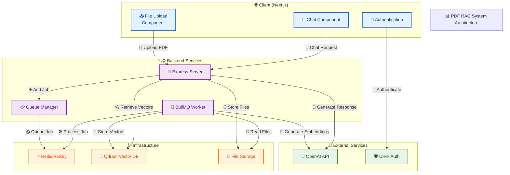
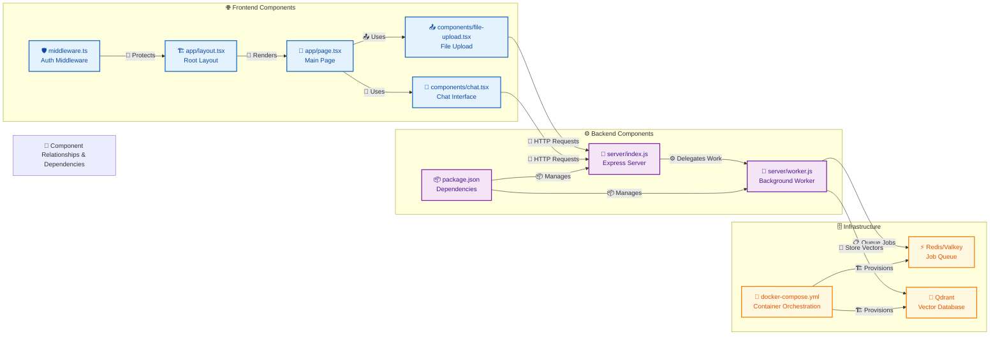
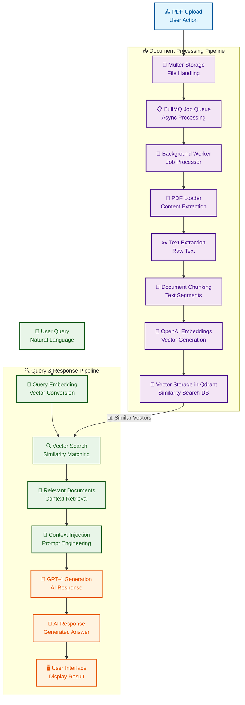
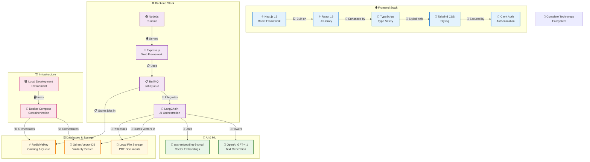

# PDF RAG Architecture Diagrams

## 🏗️ System Architecture Overview



## 🔄 RAG Pipeline Flow

```mermaid
sequenceDiagram
    %% Define participants with emojis and better names
    participant U as 👤 User
    participant F as 🌐 Frontend<br/>(Next.js)
    participant S as 🚀 Server<br/>(Express)
    participant Q as 📋 Queue<br/>(BullMQ)
    participant W as 👷 Worker<br/>(Background)
    participant V as 🧮 Vector DB<br/>(Qdrant)
    participant AI as 🤖 OpenAI<br/>(GPT-4)

    %% Document Upload Phase with visual separator
    box rgb(173, 216, 230) Document Upload Phase
    U->>F: 📤 Upload PDF file
    F->>S: POST /upload/pdf
    S->>S: 💾 Store file locally
    S->>Q: ➕ Add job to queue
    S->>F: ✅ Return upload success
    F->>U: 📋 Show upload confirmation
    end

    %% Background processing
    Q->>W: ⚙️ Process job from queue
    W->>W: 📖 Load PDF content
    W->>AI: 🧠 Generate text embeddings
    AI->>W: 📊 Return embeddings vector
    W->>V: 💾 Store embeddings in vector DB
    W->>Q: ✅ Mark job complete

    %% Chat Phase with visual separator
    box rgb(144, 238, 144) Chat Phase
    U->>F: 💬 Send chat message
    F->>S: GET /chat?message=...
    S->>AI: 🧠 Generate query embedding
    AI->>S: 📊 Return query embedding
    S->>V: 🔍 Search similar vectors
    V->>S: 📄 Return relevant documents
    S->>AI: 🎯 Generate response with context
    AI->>S: 💬 Return AI response
    S->>F: 📦 Return response + source docs
    F->>U: 🖥️ Display AI response
    end
```

## 🧩 Component Architecture



## 🌊 Data Flow Architecture



## 🛠️ Technology Stack Diagram

